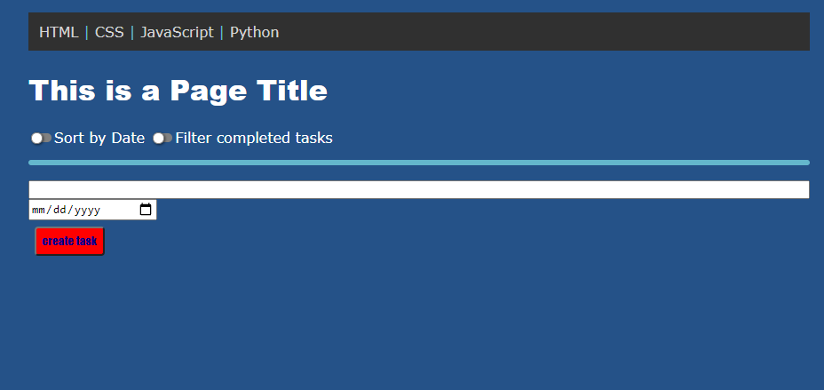
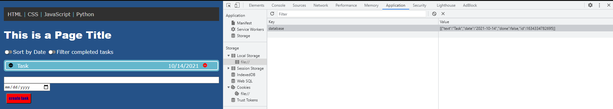
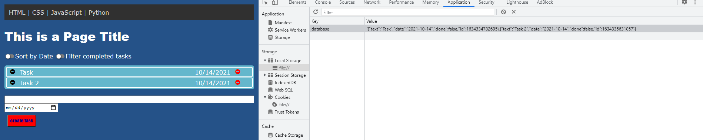
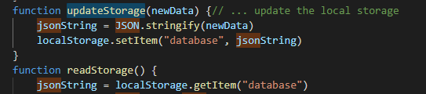
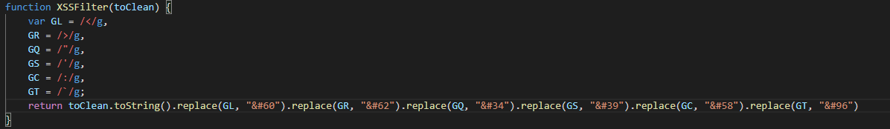
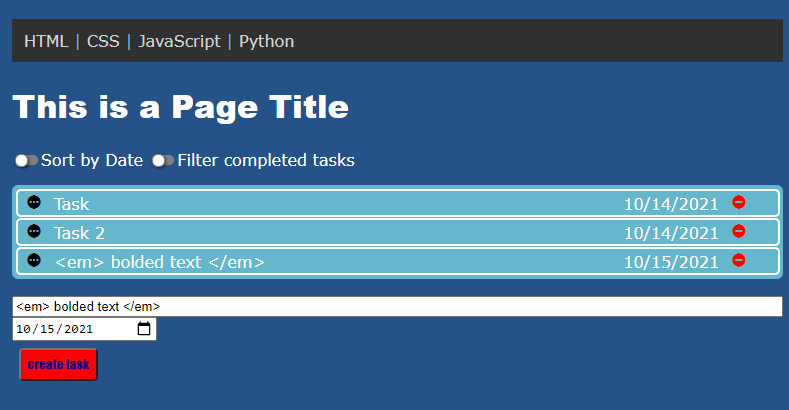

# Getting Started
So you've created your first website! That is excellent, you are now well on the way towards voicing your opinion on the internet. But what if you want to make your website a bit more interactive, or store information? You cant do any of that using simple HTML and CSS, so what you are going to need to do is store that information either on your server or on the client's browser. Setting up a database on the server is a daunting task for many new programmers so the more likely option is using JavaScript to store information on the client's browser. This can be done by storingJSON data in the user's local storage. In this Tutorial I will show you how to do just that.
# A Simple Website
I will assume in this tutorial that you already know how to use HTML and CSS to create a working website; as well as some basic knowledge of JavaScript. If you need to brush up on your JavaScript I recommend [this site](https://www.codecademy.com/catalog/language/javascript). I will be using a website I made recently as an example. 

The purpose of my website is to allow the user to more easily manage their work by organizing their tasks with this task list. The user should be able to add, remove, and update tasks as they please. As of right now, there is no functionality in the code to allow someone to add a task. This is a static website for the time being. We are going to change that.
# Why JavaScript?
ECMAScript (more commonly known as JavaScript) is an easy to learn programming language that can easily be added to a website in order to add functionality. As mentioned on [Hack Reactor](https://www.hackreactor.com/blog/what-is-javascript-used-for): 
> "JavaScript is a text-based programming language used both on the client-side and server-side that allows you to make web pages interactive. Where HTML and CSS are languages that give structure and style to web pages, JavaScript gives web pages interactive elements that engage a user. Common examples of JavaScript that you might use every day include the search box on Amazon, a news recap video embedded on The New York Times, or refreshing your Twitter feed."

# What is JSON?
JSON stands for JavaScript Object Notation. It is an easy to use method for storing objects in a string format. This can be used to store information about the website or user in the local storage of the user's browser. JSON is stored in plain text, so you should avoid storing any sensitive information such as passwords in a JSON string.
# What does JSON look like?
Here is an example of a JSON string.

JSON values are stored in a key/value pair. The key in this example is "database" which refers to all of the tasks that the user has created. The value is all of the information stored in the key. Key value pairs can be thought of as a variable, where the key is the name of the variable, and the value is the information stored in it. In this case I'm storing an object that contains 4 key value pairs inside of it.

If you'd like to see these values for yourself you can open inspect element in chrome by right clicking and selecting inspect. Then navigate to the application tab, and then select local storage. This is where your values will be stored as well so if you need to debug your code you can return here to see how things are being stored.

# Creating a JSON
Creating a JSON using JavaScript is actually very easy. All you have to do is stringify your text. Stringify is a method included in JavaScript that lets you convert an object or value into a JSON string. The syntax looks like this: 

> JSON.stringify(someStringOrObject);
    
In my example I pass pass an array that holds all of the objects (tasks) that the user has submitted. Adding a second task adds it to the JSON string as you can see in the following image. 
Each object is surrounded by curly brackets. You will be unable to see your JSON strings until you save them into the browsers local storage, which leads us into the next step.

# Saving to Local Storage
Now that you have made your JSON using stringify, you'll probably want to save that information on your user's browser. Once again this is very easy to do using JavaScript. we will use the storage interface in Javascript save a key pair to the local storage. Here is the syntax. 

> storage.setItem(keyName, keyValue);

The parameter you pass into "keyName" will appear in your local storage under the key column, and the "keyValue" you pass in should be the string you converted in the previous step; and will appear under the value column in your local storage. In my example the values I am giving to keyName is "database" which is what I am calling the list of tasks that my user inputs into the website. There is nothing stopping you from saving multiple entries and having hundreds of keys, but for simplicity I have stored all the tasks under the database key. This allows me to easily loop through all of the tasks stored in the "database". 

Please note that any information stored in local storage can be modified and removed by the user. if you want a more stable and long term database I would recommend making a SQL database and storing all your users information there. The downside to using a SQL database is that you have to host and manage all the information of all users, which could easily bloat your database's size depending on what you are storing. The benefit of storing everything in local storage is that you don't have to worry about managing it and setting aside storage space for it as it is all on your users machines.

# Accessing the Local Storage
At some point you are going to want to actually do something with the data that you have stored in your user's database. It's no fun to put information there that nobody will likely see, right? So what we are going to do is access that information. The function that we will use for it is localStorage.getItem. The syntax should be the following: 

> var someName = storage.getItem(keyName);

A couple things to remember: keyName is a string so it needs to be in quotation marks unless you are passing it a variable that is holding a string. keyName needs to be the same as the name of the key in the local storage. In my example everything is stored in "database" so my code looks like this:

 

I strinfigy any data passed into the update storage function (which in my case is user inputted "tasks"), then use localstorage.setItem to save the JSON string to the local storage. Then when I want to retrieve that information I create a variable named jsonString and set it equal to localStorage.getItem. I now have a variable that holds the JSON string that I can use in my code, however its difficult to do anything meaningful with this string, so we should convert it back into the object it once was.

# Converting JSON's Back into Objects
Luckily for us parsing JSON's is as simple as JSON.parse. As usual I will include the syntax.

> JSON.parse(jsonString);

where "jsonString" is the name of the variable where your string is saved. This function if done properly will return the originally stored information that you saved to the local storage. You can then do whatever you want with this data. In my example I save it to an array and display that array as a list of tasks on the users webpage. If you would like to display saved information to the user I would recommend reading [this tutorial]( https://www.tutorialspoint.com/how-to-add-a-new-element-to-html-dom-in-javascript).

# How to Avoid Attacks to your Website.
It would be great if everyone used websites as intended by the creators, but unfortunately that is not the case. Some people may have malicious intent and might want to do harm to your website. Because of this we will have to sanitize any inputs on our website. If your code does not have any fields where a user can input code you can disregard this section.

XSS (Cross Site Scripting) is an attack where a malicious user can input JavaScript code into an input field to modify the contents of the website. We can defend against this by sanitizing our inputs. There are several ways of doing this but the way I am going to use is replacing potentially dangerous characters (characters that can be used as operators in JavaScript) with their ascii variants. This will cause them to be interpreted as ascii rather than JavaScript and will still show up on the page, but will appear as plain text. We can use RegExp to replace some dangerous characters. Here is my code for replacing the dangerous characters.

Here you set a variable's value to a symbol located within two slashes and a "g" at the end. Then you use variableName.toString().replace(regexVarName, "asciiReplacement"). The ascii replacement should be the character in ascii which you can get using [this website]( https://www.browserling.com/tools/text-to-ascii). The syntax is ampersand pound integer where the integer is the ascii number you got from the website.

if you do this properly then any of those dangerous characters that get inserted will show up in plain text on the website. I will post an example of what this should look like if done properly. 

 

As you can see the text isn't bolded and appears as plain text.

# Read More
That's all for this tutorial, but if you'd like to learn more here are a few links and resources where you can continue to learn about making a website using JavaScript.

https://www.codecademy.com/catalog/language/javascript

https://www.tutorialspoint.com/how-to-add-a-new-element-to-html-dom-in-javascript

https://www.browserling.com/tools/text-to-ascii

https://www.w3schools.com/jsref/default.asp

https://portswigger.net/web-security/cross-site-scripting/preventing

https://developer.mozilla.org/en-US/docs/Web/JavaScript/Reference/Global_Objects/JSON

## Citations
https://www.hackreactor.com/blog/what-is-javascript-used-for
